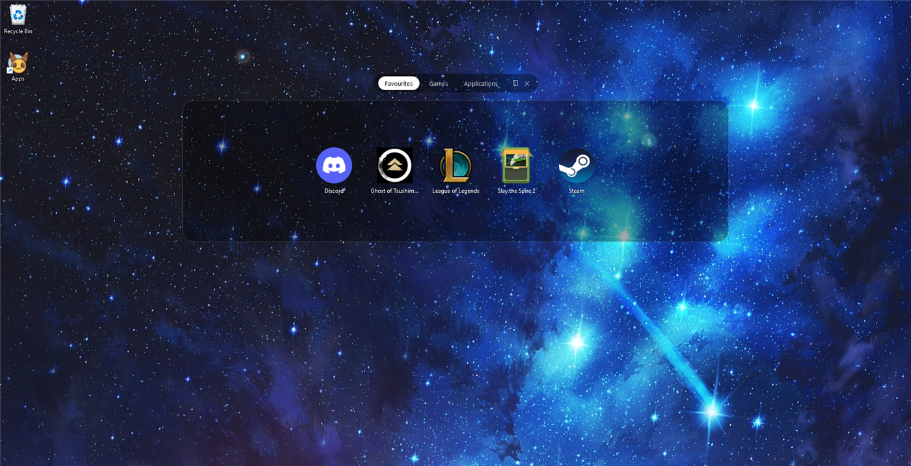
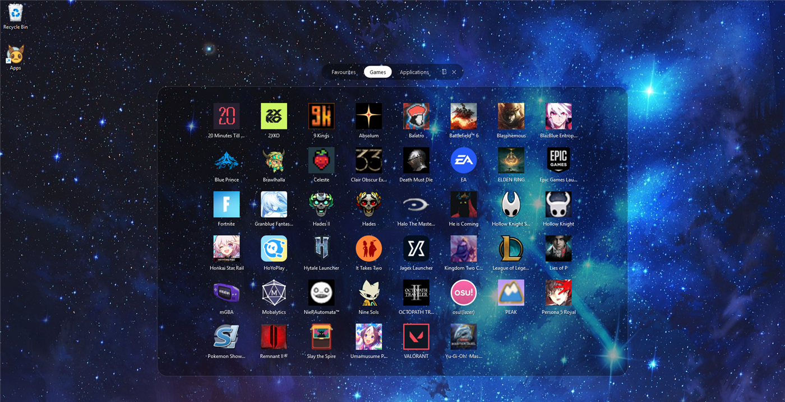

# FolderDock

A tiny Windows (WPF, .NET 8) launcher that shows a folder of shortcuts as a
floating, rounded icon grid over your wallpaper — like tapping a folder on an
iOS/macOS home screen — instead of opening File Explorer.

A small folder ("Favourites") shrinks to fit; a full one ("Games", 46 shortcuts)
auto-fits into the same panel with no scrollbar — the tab pills stay put either way.





## What it does

- Reads shortcuts from `%APPDATA%\MyApps` and shows them as a clickable icon grid.
- **Subfolders become tabs.** Put shortcuts in `%APPDATA%\MyApps\Games`,
  `%APPDATA%\MyApps\Work`, etc. and each shows as a pill at the top.
- **Tab order** follows a leading number on the folder name: `1 Games`, `2 Work`,
  `10 Media`. The number (and a following `.`, `)`, `-`, or space) is stripped
  from the tab label. Unnumbered folders sort after, alphabetically.
- The grid **auto-fits**: it picks a column count and icon size so the whole tab
  fits on screen with no scrollbar. Very full folders get smaller icons.
- **Drag an icon to reorder it** within its tab. The order is remembered in a
  hidden `.order` file in that tab's folder; shortcuts you add later appear at
  the end.
- Real 256px icons for `.exe`, `.lnk`, and `.url` (incl. Steam per-game icons),
  with a coloured first-letter tile as a fallback. Failures are logged in plain
  English to `icon_debug.log` next to the exe.
- Clear panel over the live wallpaper (no frost), pixel-snapped for sharp text.
- Dismiss with **Esc**, a click outside the panel, the **✕**, or by switching
  focus to another window. The **📁** button opens the current tab's folder in
  Explorer so you can drag shortcuts in.
- **Drag a shortcut onto the .exe** (or a shortcut to it) and it's added to the
  folder silently instead of opening the popup.

## How to use

### First run

Make a shortcut to the built `MyAppsFolder.exe`, put it on your desktop (or pin
it), and double-click. The folder it reads — `%APPDATA%\MyApps` — starts empty,
so the first run just tells you where to put things.

### Adding / removing apps

Any of these:

- Open `%APPDATA%\MyApps` in Explorer (`Win`+`R` → `%APPDATA%\MyApps`) and drop
  `.lnk` / `.url` shortcuts in.
- **Drag a shortcut onto the .exe** (or onto your desktop shortcut to it) — it's
  copied into the folder and a short confirmation shows instead of the popup.
- Open the popup, pick a tab, click the **📁** button next to the **✕** — it
  opens *that tab's* folder in Explorer, ready for you to drag shortcuts in.

To remove an app, delete its shortcut from the folder.

### Tabs = subfolders

Every subfolder of `%APPDATA%\MyApps` becomes a tab:

```
%APPDATA%\MyApps\
├── Discord.lnk          ← loose shortcuts get a first tab (named "My Apps")
├── 1 Favourites\        → tab: Favourites
├── 2 Games\             → tab: Games
└── 3 Applications\      → tab: Applications
```

- **The folder name is the tab label.**
- **A leading number sets the order** and is stripped from the label. `1 Games`,
  `2. Work`, `10) Media`, `3 - Fun` all work — the number may be followed by a
  `.`, `)`, `-`, `_`, or a space.
- Folders **without** a number come after the numbered ones, alphabetically.
- Rename or renumber a folder whenever you like — it takes effect the next time
  you open the popup, no rebuild needed.

### Reordering apps in a tab

Drag an icon and drop it where you want it — the grid reflows around it as you
move, and the new order is saved to a hidden `.order` file inside that tab's
folder. Any shortcut you add afterwards that isn't listed there just goes to the
end. Delete the `.order` file to go back to alphabetical.

### Opening and closing

- **Click an icon** to launch it — the popup then closes. It's a full click
  (press *and* release on the same icon), so a stray press can't fire something.
- **Switch tabs** by clicking a pill (also a full click).
- **Close** with `Esc`, a click anywhere outside the panel, the **✕**, or by
  clicking away to another window.

### Icons

Each shortcut shows its real icon at up to 256px. If one can't be resolved you
get a coloured tile with the app's first letter, and the reason is written to
`icon_debug.log` next to the exe.

## Build

Needs the **.NET 8 SDK** (`dotnet --version` should print `8.x`).

```sh
dotnet build src/FolderDock.csproj -c Release
```

### Standalone .exe (no .NET install required on the target machine)

```sh
dotnet publish src/FolderDock.csproj -c Release -r win-x64 --self-contained true
```

Output: `src/bin/Release/net8.0-windows/win-x64/publish/`. Keep the whole
`publish` folder together; make a shortcut to `MyAppsFolder.exe` and put that on
your desktop. (The exe keeps the name `MyAppsFolder.exe` — see the note in the
`.csproj`.)

## Configure

Edit the two lines at the top of [`App.xaml.cs`](src/App.xaml.cs):

```csharp
public static readonly string FolderPath =
    Path.Combine(Environment.GetFolderPath(Environment.SpecialFolder.ApplicationData), "MyApps");
public const string FolderTitle = "My Apps";
```

Point `FolderPath` anywhere you like (e.g. a fixed path, or
`SpecialFolder.DesktopDirectory`).

## Project layout

| File | Purpose |
|------|---------|
| `App.xaml` / `App.xaml.cs` | Startup, folder path, "dragged onto the exe" handling, empty-folder check, legacy-folder self-heal |
| `MainWindow.xaml` / `.xaml.cs` | The popup: tab bar, auto-fitting icon grid, animations, dismissal, launch |
| `IconHelper.cs` | Resolves 256px icons for folders / `.lnk` / `.url` / `.exe`; transparent-border trim; fallback |
| `AcrylicHelper.cs` | Optional Windows blur-behind (not currently wired up — see the note in the file) |

## Optional: app icon

Drop an `AppIcon.ico` next to `src/FolderDock.csproj` and uncomment the
`<ApplicationIcon>` line in the `.csproj` to give the built `.exe` a custom icon.
